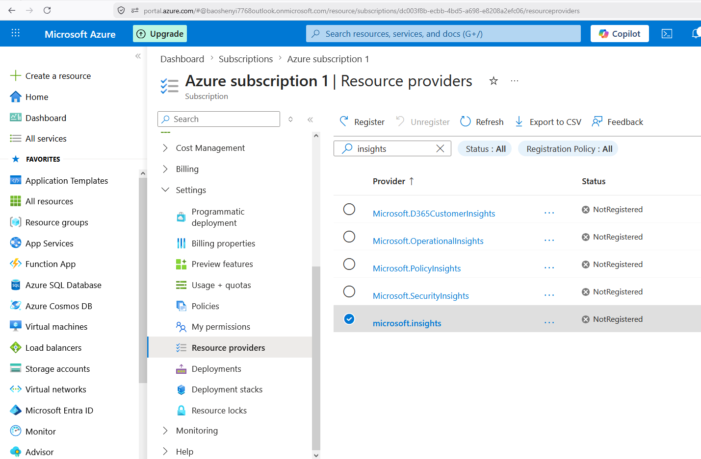
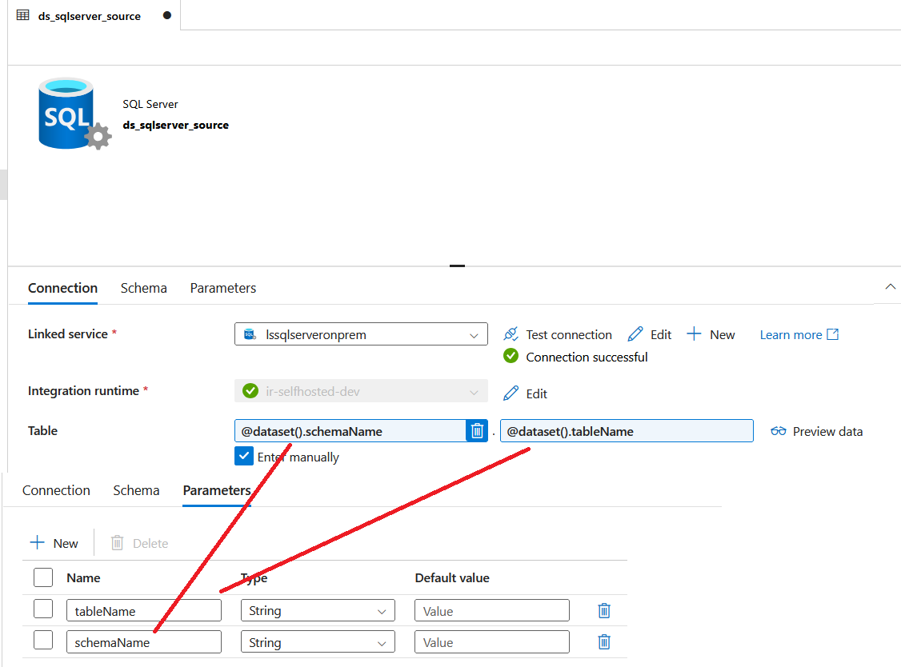

# Azure End-to-End Data Engineering Real-Time Project

## Project Overview

This project addresses a critical business need by building a comprehensive data pipeline on Azure. The goal is to extract customer and sales data from an on-premises SQL database, transform it in the cloud, and generate actionable insights through a Power BI dashboard. The dashboard will highlight key performance indicators (KPIs) related to gender distribution and product category sales, allowing stakeholders to filter and analyze data by date, product category, and gender.

## Architecture

```
On-Premises SQL Server (AdventureWorksLT2019)
        │
        │  Azure Data Factory (Self-hosted Integration Runtime)
        ▼
ADLS Gen2 – Bronze Layer (raw Parquet)
        │
        │  Azure Databricks (datetime cleanup)
        ▼
ADLS Gen2 – Silver Layer (cleansed Delta)
        │
        │  Azure Databricks (column rename: PascalCase → UPPER_SNAKE_CASE)
        ▼
ADLS Gen2 – Gold Layer (analytics-ready Delta)
        │
        │  Azure Synapse Analytics (serverless SQL views)
        ▼
Power BI Dashboard (gender split, revenue, product KPIs)
```

## Business Requirements

The business has identified a gap in understanding customer demographics—specifically gender distribution—and how it influences product purchases. The key requirements include:

1. **Sales by Gender and Product Category**: A dashboard showing the total products sold, total sales revenue, and a gender split among customers.
2. **Data Filtering**: Ability to filter the data by product category, gender, and date.
3. **User-Friendly Interface**: Stakeholders should have access to an easy-to-use interface for making queries.

## Solution Overview

To meet these requirements, the solution is broken down into the following components:

1. **Data Ingestion**:
    - Extract customer and sales data from an on-premises SQL database.
    - Load the data into Azure Data Lake Storage (ADLS) using Azure Data Factory (ADF).
    - A **Self-hosted Integration Runtime** is installed on the on-premises machine to bridge the on-prem SQL Server and the ADF cloud service.

2. **Data Transformation**:
    - Use Azure Databricks to clean and transform the data.
    - Organize the data into Bronze, Silver, and Gold layers for raw, cleansed, and aggregated data respectively.

3. **Data Loading and Reporting**:
    - Load the transformed data into Azure Synapse Analytics.
    - Build a Power BI dashboard to visualize the data, allowing stakeholders to explore sales and demographic insights.

4. **Automation**:
    - Schedule the pipeline to run daily, ensuring that the data and reports are always up-to-date.

## Technology Stack

- **Azure Data Factory (ADF)**: For orchestrating data movement and transformation, including a Self-hosted Integration Runtime for on-premises connectivity.
- **Azure Data Lake Storage Gen2 (ADLS)**: For storing raw and processed data across Bronze, Silver, and Gold layers.
- **Azure Databricks**: For data transformation and processing using Delta Lake format.
- **Azure Synapse Analytics**: For data warehousing and serverless SQL-based analytics.
- **Power BI Desktop** *(Windows only)*: For data visualization and reporting.
- **Azure Key Vault**: For securely managing credentials and secrets.
- **Azure Entra ID** *(formerly Active Directory)*: For identity management and role-based access control (RBAC).
- **SQL Server Express + SSMS (On-Premises)**: Source of customer and sales data (AdventureWorksLT2019).
- **Azure CLI**: For scripted, idempotent resource provisioning across dev / UAT / prod environments.

## Azure Cloud Shell — Your Browser-Based Deployment Machine

Azure Cloud Shell (`portal.azure.com` → click the **`>_`** icon in the top bar) is a fully managed Bash/PowerShell environment in your browser. It comes with `az`, `git`, `python3`, and other tools pre-installed and is **automatically authenticated** to your Azure subscription — no login required.

Use it to clone this repo and run any infra or utility script without needing a local Azure CLI setup:

```bash
# Clone the repo
git clone https://github.com/bobydo/azure-data-engineering.git
cd azure-data-engineering

# Show all Key Vault secret names and values
bash infra/show-secrets.sh

# Provision all Azure resources (dev environment)
bash infra/provision_step1.sh dev

# Store credentials in Key Vault
bash infra/keyvault-secrets_step2.sh dev

# Create service principal + assign ADLS role
bash infra/service-principal_step3.sh dev

# Verify all resources are healthy
bash infra/check-resources_step5.sh dev
```

> **Tip:** Cloud Shell is ideal for enterprise environments where you want all deployments to run from Azure — not from a developer's local machine. It also has persistent storage (5 GB Azure Files mount) so files survive between sessions.

---

## Infrastructure as Code

Azure resources are provisioned via [`infra/provision_step1.sh`](infra/provision_step1.sh) using the Azure CLI. The script is **idempotent** — safe to re-run at any time; existing resources are detected and skipped automatically.

The environment is passed as a parameter, keeping dev / UAT / prod fully isolated with separate resource groups and uniquely named resources:

```bash
bash infra/provision_step1.sh dev    # → rg-data-engineering-dev,  *-dev resources
bash infra/provision_step1.sh uat    # → rg-data-engineering-uat,  *-uat resources
bash infra/provision_step1.sh prod   # → rg-data-engineering-prod, *-prod resources
```

Shared config lives in [`infra/config.sh`](infra/config.sh); per-environment overrides in `infra/config.{env}.sh`. Secrets are kept out of source control via `infra/secrets.sh` (gitignored locally) or GitHub Secrets in CI/CD. Databricks notebooks accept `storage_account` as a widget parameter so the same notebook logic runs across all environments — only the target storage account changes.

### Globally-unique resource names

Azure Data Factory and Storage Account names must be **globally unique** across all Azure tenants. A fixed date suffix (`UNIQUE_SUFFIX` in [`infra/config.sh`](infra/config.sh)) is appended to avoid collisions and the ~30-minute name reservation Azure holds after a resource is deleted.

> **Current suffix: `260524`** (set 2026-05-24 — update manually in `config.sh` only if you need to recreate resources with a fresh name)

| Resource | dev | uat | prod |
|---|---|---|---|
| Storage Account | `sadataeng260524dev` | `sadataeng260524uat` | `sadataeng260524prod` |
| Azure Data Factory | `adf-data-260524-dev` | `adf-data-260524-uat` | `adf-data-260524-prod` |

---

## Setup Instructions

### Prerequisites

- An Azure account with sufficient credits (new accounts get $200 free for 30 days).
- A Windows machine for the Self-hosted Integration Runtime and Power BI Desktop.
- SQL Server Express installed locally ([download here](https://www.microsoft.com/en-us/sql-server/sql-server-downloads)).
- SQL Server Management Studio (SSMS) installed ([download here](https://learn.microsoft.com/en-us/sql/ssms/download-sql-server-management-studio-ssms)).
- **AdventureWorksLT2019** sample database restored to your local SQL Server (see Step 0 below).

---

### Step 0: Restore AdventureWorksLT2019 (On-Premises Database)

1. Download `AdventureWorksLT2019.bak` from the [Microsoft SQL Server Samples releases](https://github.com/Microsoft/sql-server-samples/releases/tag/adventureworks).
2. Copy the `.bak` file to your SQL Server backup directory, e.g.:
   ```
   C:\Program Files\Microsoft SQL Server\MSSQL15.SQLEXPRESS\MSSQL\Backup\
   ```
3. In SSMS, right-click **Databases** → **Restore Database…** → **Device** → browse to the `.bak` file, or run:
   ```sql
   RESTORE DATABASE AdventureWorksLT2019
   FROM DISK = 'C:\Program Files\Microsoft SQL Server\MSSQL15.SQLEXPRESS\MSSQL\Backup\AdventureWorksLT2019.bak'
   WITH MOVE 'AdventureWorksLT2019_Data' TO 'C:\Program Files\Microsoft SQL Server\MSSQL15.SQLEXPRESS\MSSQL\DATA\AdventureWorksLT2019.mdf',
        MOVE 'AdventureWorksLT2019_Log'  TO 'C:\Program Files\Microsoft SQL Server\MSSQL15.SQLEXPRESS\MSSQL\DATA\AdventureWorksLT2019.ldf',
        REPLACE;
   ```
4. In SSMS, right-click the server → **Properties** → **Security** → set Server Authentication to **SQL Server and Windows Authentication mode**. Restart the SQL Server service via SQL Server Configuration Manager.
5. Create a dedicated SQL login and grant it access to the Sales schema:
   ```sql
   USE AdventureWorksLT2019;
   GRANT SELECT ON SCHEMA::Sales TO <your_login>;
   ```
6. Store the login credentials as secrets in Azure Key Vault (used by ADF linked service).

---

### Pipeline Phases

| Phase | Stage | How |
|---|---|---|
| **Phase 1–4** | ⚙️ Provision Azure resources + secrets | `bash infra/provision_step1.sh dev` |
| **Phase 5** | 🔌 Connect local machine → ADF | Manual — install Self-hosted IR |
| **Phase 6** | 📥 Load local SQL Server → Bronze | ADF Studio — linked services + pipeline |
| **Phase 7** | ⚙️ Transform Bronze → Silver → Gold | Databricks cluster + notebooks (CI/CD deploys) |
| **Phase 8** | 🔑 Store Databricks PAT so ADF can trigger notebooks | `bash infra/databricks-token_step4.sh dev` |
| **Phase 9** | 🔗 Orchestrate full pipeline end-to-end | ADF Studio — add Databricks activities |
| **Phase 10** | 🗄️ Expose Gold Delta files as SQL views | Synapse Studio — serverless SQL |
| **Phase 11** | 📊 Visualize → KPI dashboard + scheduled refresh | Power BI Desktop |

> See [`RunProcess.txt`](RunProcess.txt) for the full step-by-step guide for each phase.

#### ADF Pipeline Failure Alerts

ADF has native alerting at no extra cost (no Log Analytics workspace needed).

1. **ADF Studio** → **Monitor** → **Alerts & metrics** → **New alert rule**
2. Fill in:

   | Field | Value |
   |---|---|
   | Alert rule name | `ADF Pipeline Failures` |
   | Severity | `2 – Warning` |
   | Criteria | `Failed pipeline runs metrics` → FailureType: **Select all** |
   | Condition | Greater than `0` |

3. Add action group → email notification → **Create alert rule**

> 💡 Failure types: `UserError` (bad config), `SystemError` (Azure fault), `BadGateway` (IR lost connection)



## Azure Resource Provider Reference

Every Azure service requires its namespace to be registered on the subscription before first use.
The Portal registers providers silently; CLI scripts must do it explicitly.
Re-running `az provider register` on an already-registered namespace is safe (idempotent).

### ETL / Data Engineering Stack

```bash
# ── Core pipeline ──────────────────────────────────────────
az provider register --namespace Microsoft.Storage          # ADLS Gen2 / Blob
az provider register --namespace Microsoft.DataFactory      # ADF pipelines
az provider register --namespace Microsoft.Databricks       # Spark transformation
az provider register --namespace Microsoft.Synapse          # Serverless SQL / DW
az provider register --namespace Microsoft.Sql              # Synapse SQL dependency
az provider register --namespace Microsoft.KeyVault         # Secret management
# ── Monitoring ─────────────────────────────────────────────
az provider register --namespace microsoft.insights         # Azure Monitor / alerts
az provider register --namespace microsoft.alertsmanagement # Alert rules
# ── Optional: streaming ingestion ──────────────────────────
az provider register --namespace Microsoft.EventHub         # Kafka-compatible ingestion
az provider register --namespace Microsoft.StreamAnalytics  # Real-time processing
```

### Web App Stack

```bash
# ── Compute & hosting ──────────────────────────────────────
az provider register --namespace Microsoft.Web              # App Service / Functions
az provider register --namespace Microsoft.ContainerRegistry # Docker image registry
az provider register --namespace Microsoft.ContainerService # AKS (Kubernetes)
# ── Data ───────────────────────────────────────────────────
az provider register --namespace Microsoft.Sql              # Azure SQL Database
az provider register --namespace Microsoft.DocumentDB       # Cosmos DB
az provider register --namespace Microsoft.Storage          # Blob / static files
az provider register --namespace Microsoft.Cache            # Redis cache
# ── Messaging ──────────────────────────────────────────────
az provider register --namespace Microsoft.ServiceBus       # Queue / pub-sub
az provider register --namespace Microsoft.EventGrid        # Event-driven triggers
# ── Networking ─────────────────────────────────────────────
az provider register --namespace Microsoft.Network          # VNet, Load Balancer
az provider register --namespace Microsoft.Cdn              # CDN for static assets
# ── Security & secrets ─────────────────────────────────────
az provider register --namespace Microsoft.KeyVault         # Secret management
# ── Monitoring ─────────────────────────────────────────────
az provider register --namespace microsoft.insights         # App Insights + alerts
az provider register --namespace microsoft.alertsmanagement # Alert rules
```

> **Tip:** `Microsoft.KeyVault`, `microsoft.insights`, and `microsoft.alertsmanagement` are universal — register them for any project type.
>
> To check what's already registered: `az provider list --query "[?registrationState=='Registered'].namespace" -o table`

---

## Screenshots

### Phase 5 — ADF Self-Hosted Integration Runtime
<!-- TODO: add screenshot -->

### Phase 6 — ADF Linked Services
#### SQL Server Linked Service (`lssqlserveronprem`)
<!-- TODO: add screenshot -->

#### ADLS Gen2 Linked Service (`lsadlsgen2`)
<!-- TODO: add screenshot -->

#### Databricks Linked Service (`lsdatabricks`)
<!-- TODO: add screenshot -->

### Phase 6 — ADF Datasets
#### SQL Server Source Dataset (`ds_sqlserver_source`)


#### ADLS Bronze Parquet Sink Dataset (`ds_adls_bronze_parquet`)
<!-- TODO: add screenshot -->

### Phase 6 — ADF Pipeline (`pl-ingestion-sqlserver-to-bronze`)
<!-- TODO: add screenshot -->

### Phase 7 — Databricks Notebooks
<!-- TODO: add screenshot -->

### Phase 9 — End-to-End Pipeline Run
<!-- TODO: add screenshot -->

## Conclusion

This project provides a robust end-to-end solution for understanding customer demographics and their impact on sales. The automated data pipeline ensures that stakeholders always have access to the most current and actionable insights.
