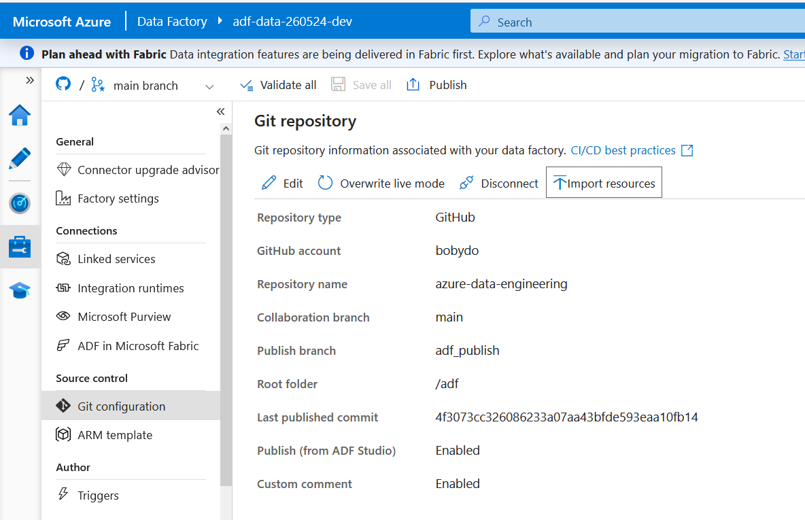

# ADF — Azure Data Factory ARM Files

This folder is managed by **ADF Studio Git integration**.  
Do **not** edit files here manually — ADF Studio writes them automatically on Publish.

---

## How to Connect ADF Studio to This Repo

1. **ADF Studio** → Manage → Source control → Git configuration → Configure
2. Fill in:

   | Field | Value |
   |---|---|
   | Repository type | GitHub |
   | GitHub account | your GitHub username |
   | Repository name | azure-data-engineering |
   | Collaboration branch | `main` |
   | Publish branch | `adf_publish` |
   | Root folder | `/adf` |

3. Click **Apply** → ADF Studio switches to Git mode
4. All future saves go to your branch (not live in Azure)
5. **Publish All** → deploys to Azure AND writes ARM JSON to this folder

---

## Folder Contents (auto-managed by ADF Studio)

These folders are **ADF defaults** — fixed by ADF, not configurable. ADF Studio creates
and writes to them automatically; you do not choose these names.

| ADF Object | Stored Folder | Example file |
|---|---|---|
| Pipeline | `pipeline/` | `pl-ingestion-sqlserver-to-bronze.json` |
| Dataset | `dataset/` | `ds_sqlserver_source.json` |
| Linked Service | `linkedService/` | `lsadlsgen2.json` (resource refs only — no secrets) |
| Trigger | `trigger/` | `triggerdaily.json` |
| Integration Runtime | `integrationRuntime/` | `ir-selfhosted-dev.json` |
| Dataflow | `dataflow/` | *(if Data Flows are added)* |
| Factory settings | `factory/` | `adf-data-260524-dev.json` |

---

## Important Notes

- **Secrets are never stored here** — linked services reference Key Vault, not raw credentials
- **Publish branch** (`adf_publish`) contains the final ARM template used for CI/CD deployment
- Until ADF Git integration is configured, these folders contain only `.gitkeep` placeholders
